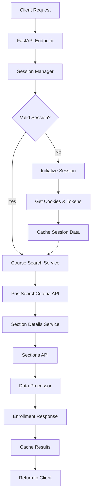

# CPCC Course Enrollment API Architecture

## 🏗️ System Overview

Based on investigation of the CPCC Ellucian Colleague Self-Service system, this API provides enrollment data for courses by subject code. The system handles authentication, session management, and data retrieval from CPCC's internal APIs.

### Key Requirements Identified
1. **Authentication Flow**: Capture cookies (`.ColleagueSelfServiceAntiforgery`) and CSRF tokens (`__RequestVerificationToken`)
2. **Data Retrieval**: Two-step process - search courses, then retrieve section details
3. **Session Management**: Maintain tokens and cookies across requests
4. **Focus**: Enrollment data (available seats, capacity, waitlist information)

## 🏛️ Architecture Diagram



## 🔧 Core Components

### 1. Session Manager
**Purpose**: Handle CPCC authentication and session management

**Key Functions**:
- Initialize session by visiting `https://mycollegess.cpcc.edu/Student/Courses`
- Extract `.ColleagueSelfServiceAntiforgery` cookie from response
- Parse `__RequestVerificationToken` from HTML content
- Maintain session state with automatic refresh
- Handle session expiration and renewal

**Implementation Notes**:
- Use `httpx.AsyncClient` with cookie jar
- Parse HTML with BeautifulSoup to extract tokens
- Implement session validation before each request
- Cache valid sessions with TTL

### 2. Course Search Service
**Purpose**: Query CPCC's PostSearchCriteria endpoint

**Endpoint**: `POST https://mycollegess.cpcc.edu/Student/Courses/PostSearchCriteria`

**Functionality**:
- Accept multiple subject codes (e.g., ["CCT", "CSC", "MAT"])
- Build search payload matching CPCC's expected format
- Handle pagination for large result sets
- Extract course IDs and matching section IDs from response

**Payload Structure**:
```json
{
  "keyword": null,
  "terms": [],
  "subjects": ["CCT", "CSC"],
  "pageNumber": 1,
  "quantityPerPage": 30,
  "searchResultsView": "CatalogListing"
}
```

### 3. Section Details Service
**Purpose**: Retrieve detailed enrollment data from Sections endpoint

**Endpoint**: `POST https://mycollegess.cpcc.edu/Student/Courses/Sections`

**Functionality**:
- Batch process section IDs from search results
- Extract enrollment metrics (available/capacity/waitlisted)
- Parse schedule and location information
- Handle rate limiting and retries

**Payload Structure**:
```json
{
  "courseId": "S26505",
  "sectionIds": ["343584"]
}
```

### 4. Data Processor
**Purpose**: Transform CPCC responses into clean enrollment data

**Functions**:
- Parse complex CPCC response structures
- Extract key enrollment metrics
- Normalize date formats and course codes
- Filter out unnecessary data fields

## 📊 Data Models

### EnrollmentInfo
```python
class EnrollmentInfo(BaseModel):
    available: int
    capacity: int
    waitlisted: int
```

### CourseSection
```python
class CourseSection(BaseModel):
    course_code: str      # e.g., "CCT-110"
    section_id: str       # e.g., "343584"
    section_name: str     # e.g., "CCT-110-N886"
    title: str           # e.g., "Intro to Cyber Crime"
    enrollment: EnrollmentInfo
    term: str            # e.g., "Spring 2026"
    start_date: str      # e.g., "2026-01-12"
    end_date: str        # e.g., "2026-05-12"
    location: str        # e.g., "Central Campus / CPCC"
    online: bool         # True if online/hybrid
```

### EnrollmentResponse
```python
class EnrollmentResponse(BaseModel):
    subjects: List[str]
    total_courses: int
    total_sections: int
    sections: List[CourseSection]
    cached_at: datetime
    cache_expires_at: datetime
```

## 🌐 API Endpoints

### Primary Endpoint
```
GET /enrollment?subjects=CCT,CSC,MAT
```

**Parameters**:
- `subjects`: Comma-separated list of subject codes
- `term` (optional): Filter by specific term
- `online_only` (optional): Filter for online courses only

**Response Example**:
```json
{
  "subjects": ["CCT", "CSC"],
  "total_courses": 15,
  "total_sections": 24,
  "sections": [
    {
      "course_code": "CCT-110",
      "section_id": "343584",
      "section_name": "CCT-110-N886",
      "title": "Intro to Cyber Crime",
      "enrollment": {
        "available": 19,
        "capacity": 24,
        "waitlisted": 0
      },
      "term": "Spring 2026",
      "start_date": "2026-01-12",
      "end_date": "2026-05-12",
      "location": "Central Campus / CPCC",
      "online": true
    }
  ],
  "cached_at": "2025-01-11T08:30:00Z",
  "cache_expires_at": "2025-01-11T08:45:00Z"
}
```

### Health Check Endpoint
```
GET /health
```

**Response**:
```json
{
  "status": "healthy",
  "session_valid": true,
  "last_cpcc_request": "2025-01-11T08:30:00Z"
}
```

## 🔄 Caching Strategy

### Session Caching
- Cache valid sessions for 30 minutes
- Automatic refresh before expiration
- Fallback to new session initialization

### Response Caching
- Cache enrollment data for 15 minutes
- Subject-specific cache keys
- Configurable TTL based on update frequency needs

### Cache Implementation
- Use Redis for production
- In-memory cache for development
- Cache invalidation on errors

## 🛡️ Error Handling

### Session Errors
- Automatic session renewal on 401/403 responses
- Retry logic with exponential backoff
- Fallback to manual session initialization

### Rate Limiting
- Respect CPCC server limits
- Implement client-side rate limiting
- Queue requests during high load

### Data Validation
- Validate subject codes against known list
- Handle malformed CPCC responses
- Graceful degradation for partial failures

## 📈 Monitoring & Logging

### Key Metrics
- Request success/failure rates
- Session renewal frequency
- Response times from CPCC endpoints
- Cache hit/miss ratios

### Logging Strategy
- Structured logging with correlation IDs
- Separate logs for session management
- Performance metrics for optimization

## 🚀 Deployment Considerations

### Environment Variables
```
CPCC_BASE_URL=https://mycollegess.cpcc.edu
CACHE_TTL_SECONDS=900
SESSION_TTL_SECONDS=1800
MAX_CONCURRENT_REQUESTS=5
LOG_LEVEL=INFO
```

### Dependencies
- FastAPI
- httpx (async HTTP client)
- BeautifulSoup4 (HTML parsing)
- Pydantic (data validation)
- Redis (caching)
- uvicorn (ASGI server)

### Performance Targets
- Response time: < 2 seconds for cached data
- Response time: < 10 seconds for fresh data
- Availability: 99.5% uptime
- Concurrent requests: Support 50+ simultaneous users

## 🔧 Development Workflow

1. **Session Management**: Implement and test session initialization
2. **Core Services**: Build search and section retrieval services
3. **API Layer**: Create FastAPI endpoints with proper validation
4. **Caching**: Add Redis caching for performance
5. **Error Handling**: Implement comprehensive error handling
6. **Testing**: Unit tests and integration tests with CPCC
7. **Documentation**: API docs and deployment guides
8. **Monitoring**: Add logging and health checks

This architecture provides a robust, scalable solution for retrieving CPCC course enrollment data while respecting the source system's constraints and providing a clean, efficient API interface.